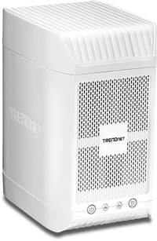
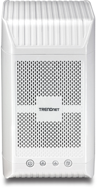

# TRENDnet TN-200





# Build:
## Setup Toolchain
```
source 00_setupenv
```
## Build kernel
```
cd linux-2.6.31.8
make
make uImage
cp arch/arm/boot/uImage ../kernel/
make INSTALL_MOD_PATH=../kernel modules_install
```
## create ramdisk: uRamdisk

## Build rootfs
### build all needed packages
* Busybox


* Create rootfs image with squashfs

```
cd ./tools/squashfs-tools-4.0/
make
cd ../../
./tools/squashfs-tools-4.0/mksquashfs ./squashfs-root image.squashfs 
```

# Firmware format
```
DECIMAL       HEXADECIMAL     DESCRIPTION
--------------------------------------------------------------------------------
128           0x80            uImage header, header size: 64 bytes, header CRC: 0xFA331606, created: 2012-05-16 07:16:13, image size: 2610980 bytes, Data Address: 0x8000, Entry Point: 0x8000, data CRC: 0xFEBFC9A6, OS: Linux, CPU: ARM, image type: OS Kernel Image, compression type: none, image name: "Linux-2.6.31.8"
192           0xC0            Linux kernel ARM boot executable zImage (little-endian)
13436         0x347C          gzip compressed data, maximum compression, from Unix, last modified: 2012-05-16 07:16:10
2611172       0x27D7E4        uImage header, header size: 64 bytes, header CRC: 0x9E995099, created: 2012-11-30 11:01:23, image size: 1749543 bytes, Data Address: 0xE00000, Entry Point: 0xE00000, data CRC: 0x7EC3A246, OS: Linux, CPU: ARM, image type: RAMDisk Image, compression type: gzip, image name: "Ramdisk"
2611236       0x27D824        gzip compressed data, has original file name: "ramdisk_el", from Unix, last modified: 2012-11-15 01:53:02
4362828       0x42924C        Squashfs filesystem, little endian, version 4.0, compression:lzma, size: 30073224 bytes, 2548 inodes, blocksize: 131072 bytes, created: 2016-03-16 08:19:39
34439756      0x20D824C       gzip compressed data, from Unix, last modified: 2016-03-16 08:19:43
```
create final firmware by tool: "merge/merge" <br>
All source files should be place in folder: merge/TNA-200/

 * uImage

u-boot legacy uImage, Linux-2.6.31.8, Linux/ARM, OS Kernel Image (Not compressed), 2610980 bytes, Wed May 16 07:16:13 2012, Load Address: 0x00008000, Entry Point: 0x00008000, Header CRC: 0xFA331606, Data CRC: 0xFEBFC9A6

 * uRamdisk

u-boot legacy uImage, Ramdisk, Linux/ARM, RAMDisk Image (gzip), 1749543 bytes, Fri Nov 30 11:01:23 2012, Load Address: 0x00E00000, Entry Point: 0x00E00000, Header CRC: 0x9E995099, Data CRC: 0x7EC3A246

 * image.cfs (squashfs(0x800 offset))

```
 dd if=image.cfs of=image.squashfs bs=1 skip=2048
 sudo mount -t squashfs -o loop image.squashfs ./squashfs
```
 * default.tar.gz


#TODO:
 * How to create image.squashfs to image.cfs?
